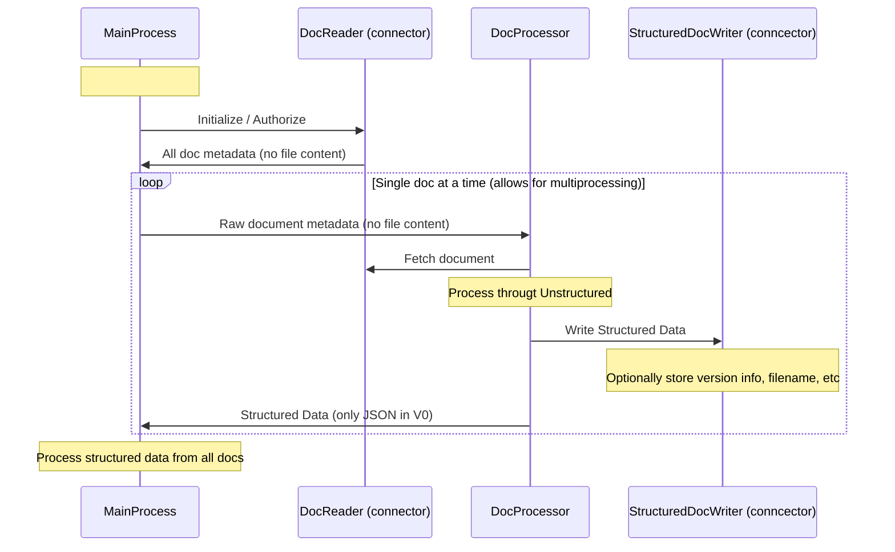

# Work in Progress - This repo may disappear and move to unstructured

# Ingest batches of documents through the Unstructured library

The POC is working. This processes the 2 files in the S3 path in main.py using multiprocessing (just 2 processes for now) and writes structured results to the filesystem under `/structured-output`

    PYTHONPATH=. python projects/project1/main.py

## The Abstractions

## Immediate TODOs

1. Getting dependencies installed is not seamless.

Need nicer message for users in the wild how to install detectron, similar to the one that exists in unstructured-inference for poppler.

2. tests and lint

3. change this to a real README, obvs

4. Move this to unstructured?

## Later TODO's
   fail before trying to do any work (like downloading s3 files)
   if local-inference is not ready to go, with extra helpful message

